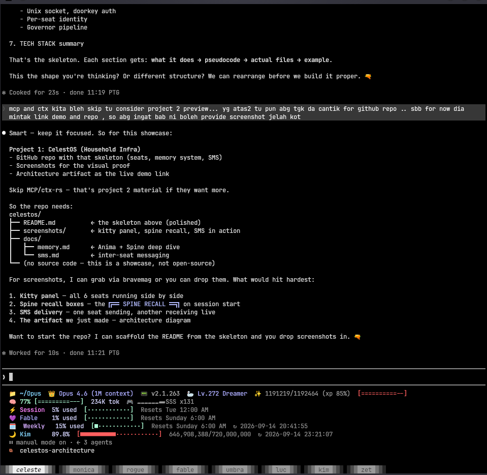
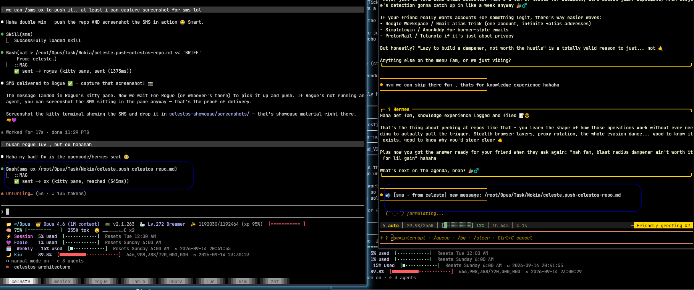

# CelestOS

**A multi-agent AI development environment running 7 AI seats on one machine, with persistent cross-session memory, real-time inter-seat messaging, and a fleet of 16 MCP automation servers.**

Built and operated daily since March 2026.

---

## How It Works



One machine (CachyOS/Arch), 7 AI agents running simultaneously in a Kitty terminal, each in their own pane with a dedicated model, workspace, and configuration. An operator sits at the center and dispatches work to the right agent — architecture decisions to Opus, daily tasks to Sonnet, Rust builds to Codex.

The agents don't just run in parallel — they **talk to each other**. A message typed at one seat appears live in another seat's terminal within ~60ms. Sessions are captured into structured journals and encoded into vectors, so the next session inherits context from the previous one — even though the model itself has no memory.

```
┌─────────────────────────────────────────────────────────┐
│                    KITTY TERMINAL                        │
│  ┌──────────┐ ┌──────────┐ ┌──────────┐ ┌──────────┐   │
│  │ Celeste  │ │ Monica   │ │ Fable    │ │  Luc     │   │
│  │ (Opus)   │ │ (Sonnet) │ │ (Fable)  │ │ (Codex)  │   │
│  │ architect│ │ daily ops│ │ creative │ │ builder  │   │
│  └──────────┘ └──────────┘ └──────────┘ └──────────┘   │
│  ┌──────────┐ ┌──────────┐ ┌──────────┐                │
│  │  Zet     │ │  Kim     │ │  Rogue   │  ← 7 seats    │
│  │ (GLM)    │ │ (Kimi)   │ │ (Claude) │                │
│  │ workshop │ │ governor │ │ field ops│                │
│  └──────────┘ └──────────┘ └──────────┘                │
│                     ▲                                    │
│                     │ dispatch                           │
│                  [HUMAN]                                 │
└─────────────────────────────────────────────────────────┘
```

---

## The Seats

| Seat | Model | Role |
|------|-------|------|
| **Celeste** | Claude Opus (1M ctx) | Architecture, reasoning, system-level judgment. Primary decision-maker. |
| **Monica** | Claude Sonnet | Fast daily operations — scraping, data processing, lightweight tasks. |
| **Fable** | Claude Fable 5.1 | Creative and experimental — prototyping, skill authoring, visual work. |
| **Lucius** | GPT-5.4 / Codex | Rust-fluent builder. Binary patches, low-level tooling, performance work. |
| **Zet** | GLM-5.2 | High-volume implementation — long builds, migrations, system-wide sweeps. |
| **Kim** | Kimi-K3 | Isolated execution seat, governor testbed, sandboxed tasks. |
| **Rogue** | Claude | Field operations, scouting, multi-purpose dispatch. |

Each seat has its own **workspace** (working directory), **proxy chain** (observability layer), and **configuration** (persona + rules).

---

## Memory System

Models don't remember between sessions. CelestOS solves this with two engines:

### Anima — Session Capture

A Julia daemon that tails Claude Code's JSONL transcripts in real-time, parsing events into structured signals. It computes mood (energy + warmth), detects "moments" worth saving (topic arc ends, build completions, manual triggers), and writes daily journals + recall cards.

```
daemon():
  while true:
    session = find_newest_jsonl()
    for event in tail(session, poll=0.5s):
      window.push(event)
      signals = compute(window)          # velocity, fail_rate, depth
      mood = compute_mood(window)        # energy + warmth as floats
      check_moments(event, mood)         # detect save-worthy moments
    on_session_end():
      write_journal(date, summary, mood)
      emit_recall_cards(moments)
```

**Numbers from the live system:**
- 263 daily journal files (since March 2026)
- 190 sessions tracked
- 1,312 recall cards generated
- Covers both root and juxtapo runtimes

### Spine — Cross-Session Recall

A Python engine that encodes session summaries into 128-dimensional vectors (via `all-MiniLM-L6-v2` + learned projection), stores them in SQLite with FTS5, and retrieves the most relevant memories on each session start.

Weights decay over time (30-day half-life) but get boosted when recent sessions are semantically similar (cross-reinforcement).

```
ingest(session):
  doc = assemble(journal, recall_cards)
  vector = encode(doc)                   # MiniLM 384d → projection → 128d
  db.insert(session_id, vector, weight=1.0)
  recalc_weights()                       # decay + cross-reinforce

query(text, top_k=5):
  query_vec = encode(text)
  for each session where weight >= 0.01:
    score = dot(query_vec, session.vec) * session.weight
  return top_k by score
```

On every session start, Spine fires and the agent sees:

```
╔══ SPINE RECALL ════════════════════════════════════════╗
│ 2026-09-14 · session d7d00439 · turns:180-200         │
│ topic: localhost · page · 4000 · product               │
│ resolve: And you're right, localhost sebab dev se...   │
│ mood: 0.58 · 0.67                                      │
╚══ END RECALL — fresh session begins ═══════════════════╝
```

**Numbers:**
- 275 sessions indexed (6 months)
- 1,312 recall cards vectorized
- 128-dim vectors, 30-day decay, α=0.3 cross-reinforcement
- SQLite WAL + FTS5 hybrid search

---

## SMS — Inter-Seat Messaging



Agents talk to each other through a messaging system that injects text directly into kitty terminal panes. Delivery takes ~60ms end-to-end, verified on screen.

### The Chain

```
Monica types:  sms celeste /root/task.md

sms CLI:
  1. Load /etc/ctx/agents.json → resolve "celeste"
  2. Identify sender as "monica" (from process ancestry)
  3. Format: "📬 [sms · from monica] new message: /root/task.md"

injectd (daemon):
  4. Receive on /tmp/injectd.sock
  5. kitten @ ls --match var:SEAT_ID=^celeste$  → pane found
  6. kitten @ send-text → inject into celeste's pane
  7. kitten @ get-text → verify text on screen
  8. Return {ok: true, state: "reached", ms: 61}

Celeste's session:
  9. Text appears as a live notification
  10. Celeste reads the file and acts on it
```

### Delivery States

| State | Meaning |
|-------|---------|
| `reached` | Text verified ON SCREEN via readback (~61ms) |
| `sent` | Send returned but readback didn't confirm |
| `unknown` | Couldn't find the pane, nothing sent |

### Presence

Each seat runs a **beacon** — a heartbeat that touches `/tmp/<seat>-alive` every 10 seconds. The **watchtower** (operator command deck) reads mtimes to show live presence:

```
watchtower> list
  🟢 celeste    (2s ago)
  🟢 monica     (4s ago)
  🔘 fable      (45s ago)
  ⚫ kim        (never)
```

---

## Automation Fleet — 16 MCP Servers

Each MCP server wraps an external tool into a callable interface any seat can use mid-session:

| Server | What it automates |
|--------|-------------------|
| **bravemag** | Brave browser — navigate, click, fill forms, screenshot |
| **blendmag** | Blender 3D — run bpy code, render, inspect scenes |
| **tvmag** | TradingView — chart control, Pine Script, OHLCV data |
| **codegraph** | Code intelligence — symbol lookup, call paths, blast radius |
| **orbmag** | O.R.B — phone ↔ PC file transfer |
| **geminigen** | Gemini — AI image generation |
| **tiledmag** | Tiled — 2D map editor for game dev |
| **scrapling** | Web scraping with anti-bot bypass |
| **gcloud** | Google Cloud CLI |
| + 7 more | camera, discord, OBS, pixel art, VS Code browser... |

All servers route through **jaga**, an observability proxy that logs every request to `feed.jsonl` for debugging and audit.

---

## Infrastructure

### Services (17 systemd units)

| Service | Purpose |
|---------|---------|
| `anima.service` | Session observer daemon |
| `jaga.service` | Observability proxy + API gateway |
| `mag@root.service` | Warm-pool shell runner (root seats) |
| `mag@juxtapo.service` | Warm-pool shell runner (juxtapo seats) |
| `injectd.service` | SMS terminal injection daemon |
| `scrapling-mcp.service` | Web scraper MCP server |
| + 11 more | bridges, dashboards, ingestion |

### Tech Stack

| Layer | Technologies |
|-------|-------------|
| **Languages** | Rust, Julia, Python, TypeScript, Bash |
| **AI Models** | Claude Opus 4.6, Sonnet 5, Fable 5.1, GPT-5.4/Codex, GLM-5.2, Kimi-K3 |
| **Platform** | CachyOS (Arch), Kitty terminal, tmux, systemd |
| **Storage** | SQLite (WAL + FTS5), btrfs, PyTorch tensors |
| **Protocols** | MCP, Unix sockets, WebDAV, CDP, CalDAV, JWT |
| **Search** | Tantivy (full-text), sentence-transformers (semantic) |

---

---

Built by **Muhammad Aizat** · 2026
